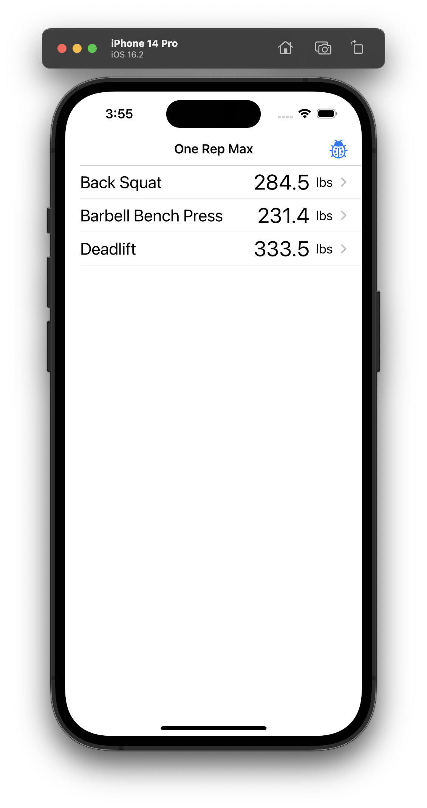
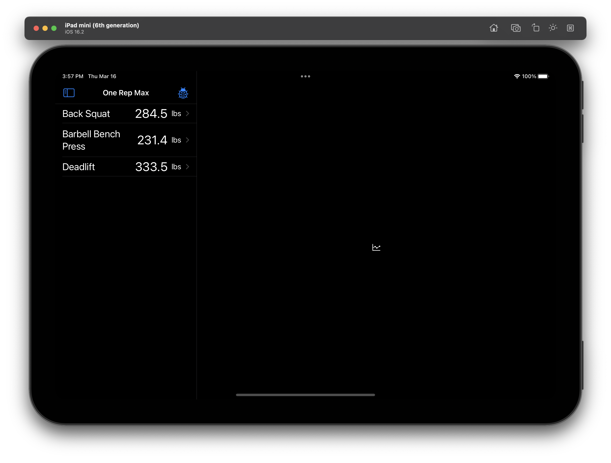
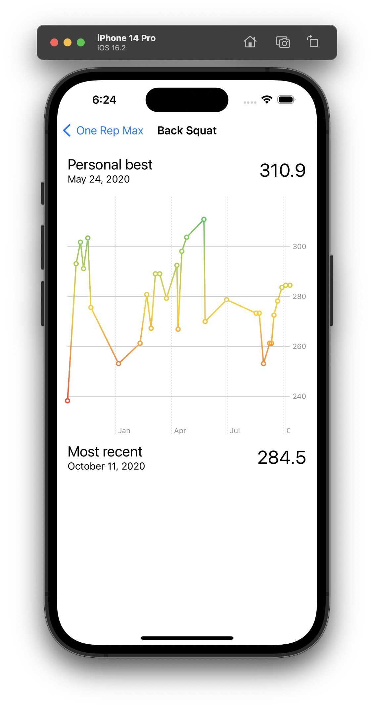
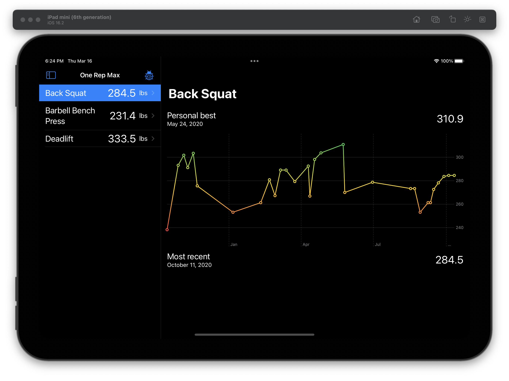
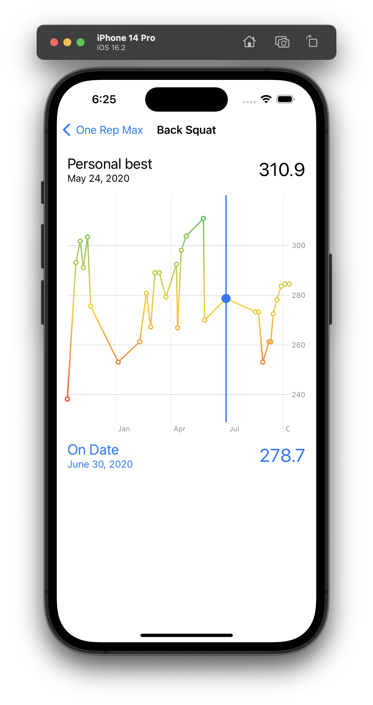
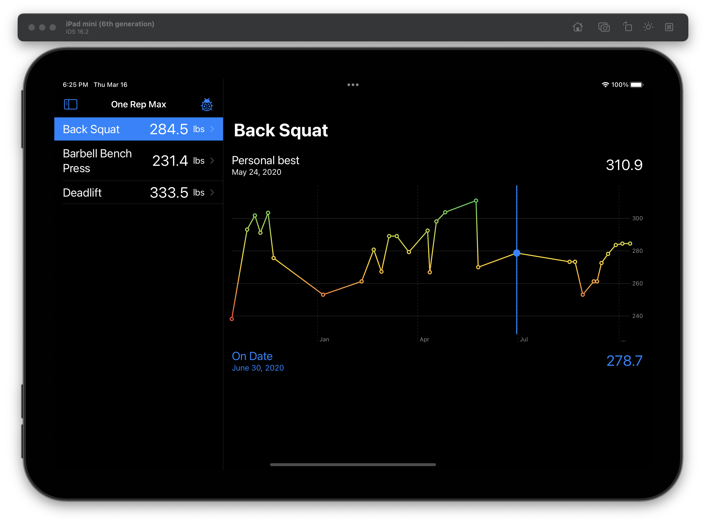
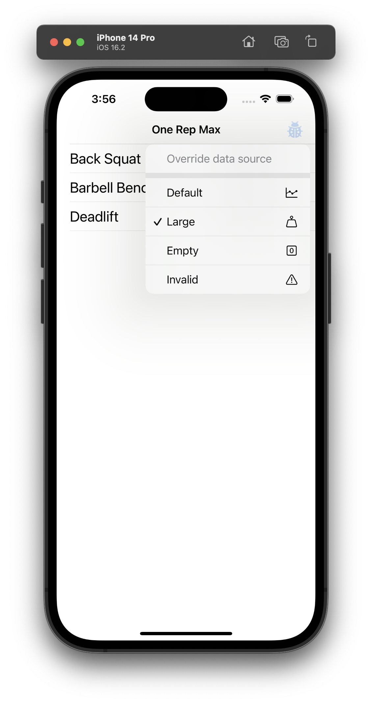

# One Rep Max and Charts Take Home Project

## Requirements

- Xcode 14.2
- iOS 16.2

## Install

- Open `OneRepMax.xcodeproj`
- Build and run (CMD + R)
- Test (CMD + U)

### 3rd party dependencies

- The project utilizes [Swift Collections](https://www.swift.org/blog/swift-collections/) to group and order the data input

| iPhone | iPad |
|---|---|
|  |  |

## Architecture

The project uses SwiftUI architecture. Views that require additional business logic to display data are backed by their respective model objects. This allows for testing business logic in isolation.

## Key areas of focus

### Testability

My focus was to allow for extensive testability. Every dependency is injected as an interface which allows for easy mock-ability when running tests.

### Charts

This was a first time I have used Swift Charts and it was a very interesting experience. They are very easy to implement and seem to support a vast variety of customization and visualization options. I wish it was slightly easier to support large data sets - either in form of scrolling or paging. I have initially attempted to scroll charts that had to show larger data ranges but I was not quite able to work with `GeometryReader` and set the right horizontal offset. This is why I'm limiting to only show past 31 days (or one month on iPhone devices) or 93 days (or three months on iPad devices) at a time. I made this decision to prevent from over-populating the chart in case there were too many data points. A user who worked out each day in the past 31/93 days should be able to see 31/93 one rep maxes on the chart. If they didn't exercise every day they will be able to see past 31/93 one rep maxes potentially going further in the past.

| iPhone | iPad |
|---|---|
|  |  |

In addition to rendering the chart, users can also interact with it by tapping and dragging over it. This temporarily shows a ruler and currently selected date & one rep max value. Once the gesture is done it goes back to default state showing the latest one rep max.

| iPhone | iPad |
|---|---|
|  |  |

## Data flow

1. `OneRepMaxList` initiates the fetching of the historical data asynchronously through its model object (`OneRepMaxListModel`).
2. The model uses `DataProvider` to fetch the array of one rep maxes.
3. `DataProvider` on the other hand uses `DataService` to read data from the disk.
4. `DataService` reads the file into memory and encodes it into a `String`.
5. The `String` input is then parsed by `Parser` which goes line by line trying to instantiate an `Exercise` model.
6. If there's an issue at any point the whole chain throws an error.
7. Otherwise an array of `[Exercise]` is returned back to `DataProvider` which filters out only those exercises that have the maximum one rep max per any given day. During the process, it also finds the overall one rep max (PR) and groups the output by exercise name.
8. Finally an array of `[OneRepMax]` is returned to the model, grouped by exercise name and sorting past exercises in descending order (for visualization purposes).
9. The model updates its state on `MainActor` and finishes the loop.

## Modularity

The project currently uses one app target and one unit test target. This seemed like an appropriate complexity for such an exercise. If we were to add more features or services, it might make sense to re-consider moving those to separate modules. Doing so would enable development in isolation - i.e. building a standalone feature app. Additionally, if we employed better modularization where the app target would act solely as the integration layer, we wouldn't need to use the host application to run unit tests in a simulator resulting in much faster test runs.

The project root acts as an integration entry point of the app. The `Model` group defines simple model objects. The `Feature` group includes components needed for the implementation of the list & detail feature. And finally, the `Service` module provides a mechanism for reading data from the disk, parsing it, and sorting & ordering it.

## Extras

For debugging purposes, the app provides an easy way to change the data source during runtime, allowing for easier end-user testability. Non-production builds show debug button in the navigation bar with a menu that supports overriding the input file.

## Trade-offs

- The project uses `OrderedCollections` from [Swift Collections](https://www.swift.org/blog/swift-collections/) in order to manipulate data in a performant way.

- The chart limits data to the 31 latest inputs (on iPhone devices) or 93 (on iPad devices). This decision should provide good enough user experience without over-populating the graph. I toyed with the idea of using `stride` with a `step` value of 31/93 for all exercises but it seemed less relevant seeing very old records in contrast to showing the latest.

- Reading the file with historical data does not happen sequentially. I have tested this approach for small files and large input files (up to 100k+ lines) and the performance (memory footprint) was manageable. For anything larger it might be worth considering not reading the whole file into memory at once, but rather reading line by line.

- The `Environment` object, used as a static in-memory cache, is global in scope. It's easy to read from and write to from anywhere. Because of that, it's not participating in proper dependency injection and can be hard to test. On the other hand, it's only compiled for non-production builds, making it more beneficial than introducing more complex caching.